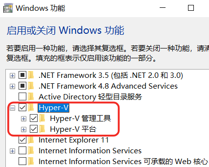
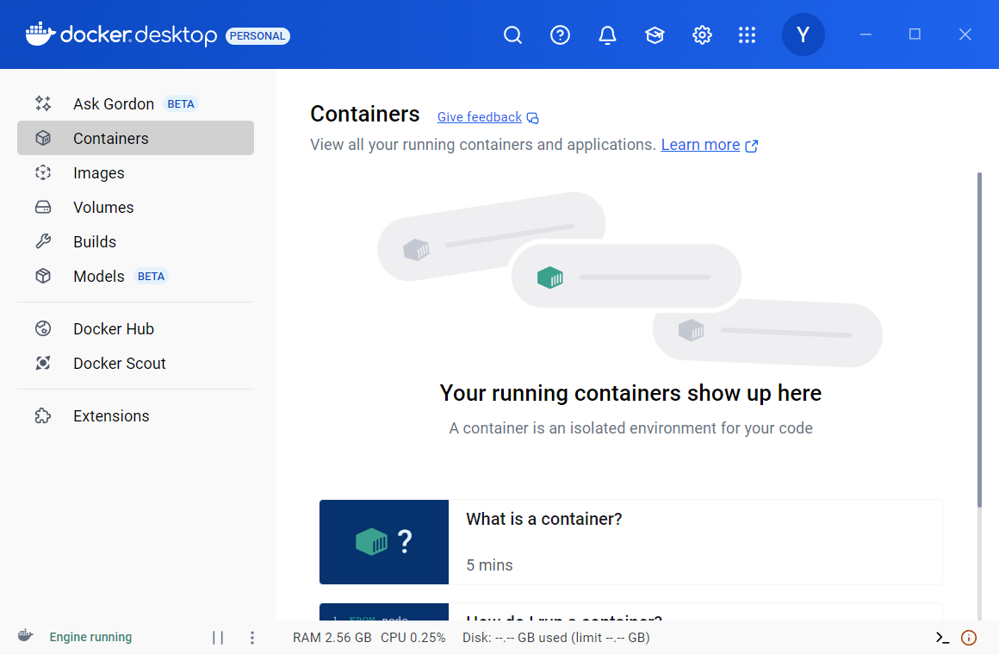
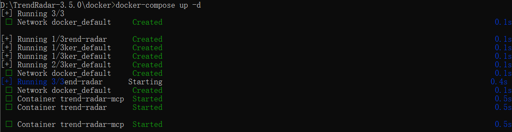
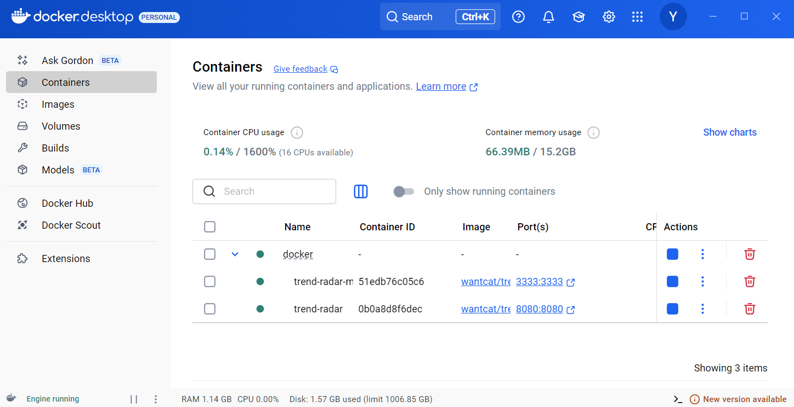
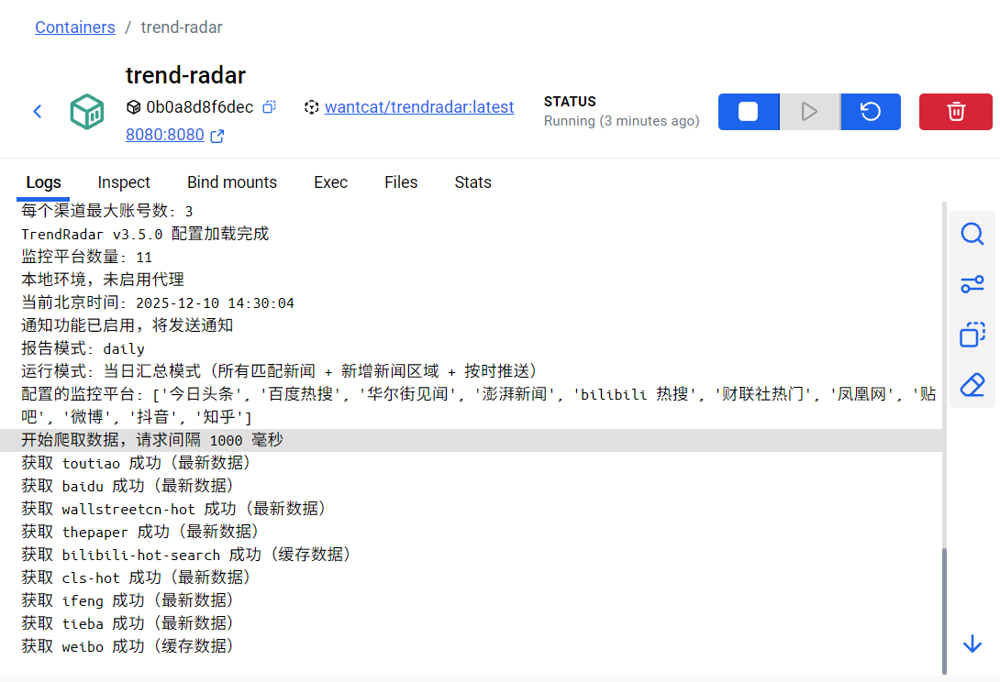
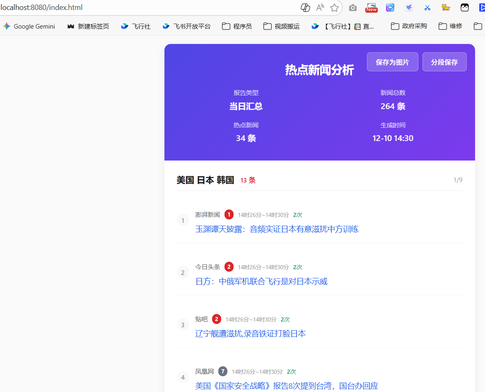
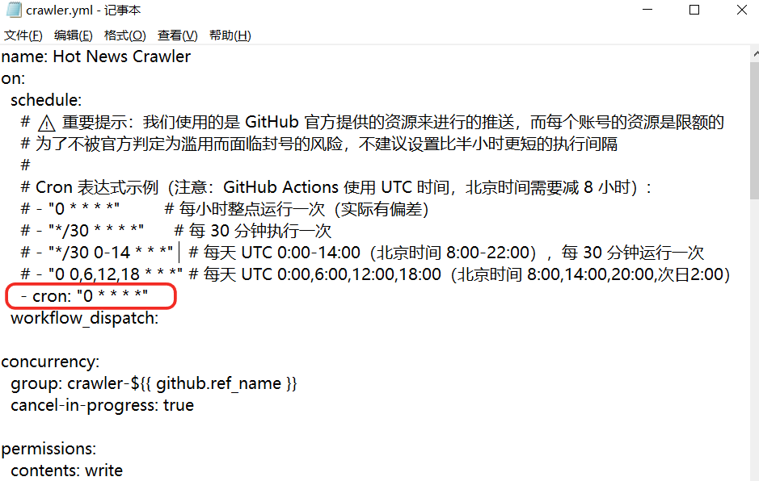

开源项目地址[sansan0/TrendRadar: 🎯 告别信息过载，AI 助你看懂新闻资讯热点，简单的舆情监控分析 - 多平台热点聚合+基于 MCP 的AI分析工具。监控35个平台（抖音、知乎、B站、华尔街见闻、财联社等），智能筛选+自动推送+AI对话分析（用自然语言深度挖掘新闻：趋势追踪、情感分析、相似检索等13种工具）。支持企业微信/个人微信/飞书/钉钉/Telegram/邮件/ntfy/bark/slack 推送，1分钟手机通知，无需编程。支持Docker部署⭐ 让算法为你服务，用AI理解热点](https://github.com/sansan0/TrendRadar)


# 1、安装windows Hyper-V组件


# 2、安装Docker Desktop


# 3、获取代码
```
git clone https://github.com/sansan0/TrendRadar.git
``` 
但是，git失败，所以我用的方法是到## [Releases](https://github.com/sansan0/TrendRadar/releases)下载了最新版本到本地，解压到文件夹D:\TrendRadar-3.5.0

# 4、获取飞书`Webhook URL` 测试使用
- 在飞书上新建一个群组——创建群组
	- **群模式**：选择对话
	- **群名称**：可以简单命名为 `TrendRadar测试群`。
	- **添加成员**：为了测试不打扰他人，**在搜索框中搜索并添加自己的名字**，创建一个只有一个人的群即可。
	- 创建完成后，就可以在群设置里添加“自定义机器人”,- 给机器人起个名字，例如 “热点雷达”。并获取 `Webhook URL` 。
` https://open.feishu.cn/open-apis/bot/v2/hook/a6d65e5f-0003-43b7-a8ea-26bf83281543`

#  🎛️5、检查设置环境变量
来到代码的目录下，使用记事本查看`.env`文件。
- **开启核心开关**（如果还没开启）：
```
    # 是否启用爬虫 (true/false)
    ENABLE_CRAWLER=true
    # 是否启用通知 (true/false)
    ENABLE_NOTIFICATION=true
```
- 将飞书机器人**webhook URL**添加到指定位置：
```
# 飞书机器人 webhook URL（多账号用 ; 分隔）
FEISHU_WEBHOOK_URL=https://open.feishu.cn/open-apis/bot/v2/hook/a6d65e5f-0003-43b7-a8ea-26bf83281543
```
保存。

# 6、装载Docker镜像并运行
- 在D:\TrendRadar-3.5.0\docker地址栏输入CMD回车进入命令窗口。
目录中的 `docker-compose.yml` 和 `docker-compose-build.yml` 区别在于：
- `docker-compose.yml`：**直接使用线上编译好的镜像**，启动最快，是常规选择。
- `docker-compose-build.yml`：**从源代码重新构建镜像**，仅在你想修改代码或Dockerfile，需要自定义构建时使用。
**使用docker-compose up -d命令**，它会默认读取 `docker-compose.yml` 文件。

此时Docker Desktop上随即运行起trend-rad，单击后可查看运行日志详情。


飞书上也随即收到机器人发来的信息。

# 7、设置搜索的热点关键词
在D:\TrendRadar-3.5.0\config目录下，打开frequency_words.txt文件，修改你所需要的关键词。

# 8、**Web 服务器支持**
- 新增内置 Web 服务器，支持通过浏览器访问生成的报告
- 通过 `manage.py` 命令控制启动/停止：`docker exec -it trend-radar python manage.py start_webserver`
- 访问地址：`http://localhost:8080`（端口可配置）

当日汇总 HTML 同时生成到两个位置
- `index.html`（项目根目录）：供 GitHub Pages 访问
- `output/index.html`：通过 Docker Volume 挂载，宿主机可直接访问

# 9、报告配置
**配置位置：** `config/config.yaml` 的 `report` 部分
```
report:
  mode: "daily"                    # 推送模式
  rank_threshold: 5                # 排名高亮阈值
  sort_by_position_first: false    # 排序优先级
  max_news_per_keyword: 0          # 每个关键词最大显示数量
  reverse_content_order: false     # 内容顺序配置
```
#### 配置项详解

|配置项|类型|默认值|说明|
|---|---|---|---|
|`mode`|string|`daily`|推送模式，可选 `daily`/`incremental`/`current`，详见 [推送模式详解](https://github.com/sansan0/TrendRadar?tab=readme-ov-file#3-%E6%8E%A8%E9%80%81%E6%A8%A1%E5%BC%8F%E8%AF%A6%E8%A7%A3)|
|`rank_threshold`|int|`5`|排名高亮阈值，排名 ≤ 该值的新闻会加粗显示|
|`sort_by_position_first`|bool|`false`|排序优先级：`false`=按热点条数排序，`true`=按配置位置排序|
|`max_news_per_keyword`|int|`0`|每个关键词最大显示数量，`0`=不限制|
|`reverse_content_order`|bool|`false`|内容顺序：`false`=热点词汇统计在前，`true`=新增热点新闻在前|
#### 内容顺序配置（v3.5.0 新增）
控制推送消息和 HTML 报告中两部分内容的显示顺序：

|配置值|显示顺序|
|---|---|
|`false`（默认）|① 热点词汇统计 → ② 新增热点新闻|
|`true`|① 新增热点新闻 → ② 热点词汇统计|

**适用场景：**
- `false`（默认）：适合关注关键词匹配结果的用户，先看分类统计
- `true`：适合关注最新动态的用户，优先查看新增热点

# 10、执行频率配置
**配置位置：** `.github/workflows/crawler.yml` 的 `schedule` 部分

```yaml
on:
  schedule:
    - cron: "0 * * * *"  # 每小时运行一次
```

#### 什么是 Cron 表达式？
Cron 是一种定时任务格式，由 5 个部分组成：`分 时 日 月 周`
```
┌───────────── 分钟 (0-59)
│ ┌───────────── 小时 (0-23)
│ │ ┌───────────── 日期 (1-31)
│ │ │ ┌───────────── 月份 (1-12)
│ │ │ │ ┌───────────── 星期 (0-6，0=周日)
│ │ │ │ │
* * * * *
```
#### 常用配置示例

| 想要的效果     | Cron 表达式          | 说明                    |
| --------- | ----------------- | --------------------- |
| 每小时运行     | `0 * * * *`       | 每小时的第 0 分钟运行（默认）      |
| 每 30 分钟运行 | `*/30 * * * *`    | 每隔 30 分钟运行一次          |
| 每天早 8 点运行 | `0 0 * * *`       | UTC 0:00 = 北京时间 8:00  |
| 工作时间运行    | `*/30 0-14 * * *` | 北京 8:00-22:00，每 30 分钟 |
| 每天 3 次    | `0 0,6,12 * * *`  | 北京 8:00、14:00、20:00   |

#### 重要提示

> ⚠️ **时区注意**：GitHub Actions 使用 **UTC 时间**，北京时间需要 **减 8 小时**
> 
> - 想要北京时间 8:00 运行 → 设置 UTC 0:00
> - 想要北京时间 20:00 运行 → 设置 UTC 12:00

> ⚠️ **频率限制**：GitHub 对每个账号的 Actions 运行次数有限额
> 
> - **建议**：不要设置比 30 分钟更短的间隔
> - **原因**：过于频繁可能被判定为滥用，面临封号风险
> - **实际情况**：GitHub Actions 执行时间本身就有偏差，设置太精确意义不大

#### 修改方法
1. 打开你 fork 的仓库
2. 找到 `.github/workflows/crawler.yml` 文件
3. 点击编辑（铅笔图标）
4. 修改 `cron: "0 * * * *"` 中的表达式
5. 点击 "Commit changes" 保存

## 🤖 AI 智能分析

TrendRadar v3.0.0 新增了基于 **MCP (Model Context Protocol)** 的 AI 分析功能，让你可以通过自然语言与新闻数据对话，进行深度分析。
#### 故障排查
```shell
# 检查容器状态
docker inspect trend-radar

# 查看容器日志
docker logs --tail 100 trend-radar

# 进入容器调试
docker exec -it trend-radar /bin/bash

# 验证配置文件
docker exec -it trend-radar ls -la /app/config/
```