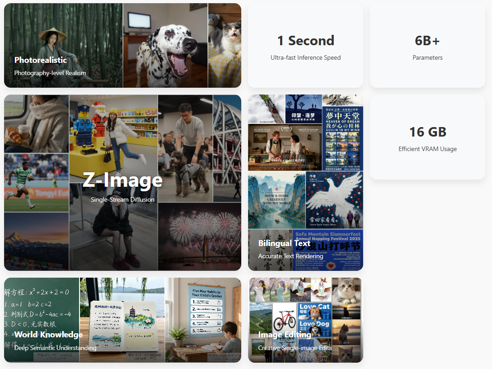

仓库地址[通义 MAI/Z 形象 --- Tongyi-MAI/Z-Image](https://github.com/Tongyi-MAI/Z-Image)
官网：[Z-Image - Efficient Image Generation with Single-Stream Diffusion](https://tongyi-mai.github.io/Z-Image-blog/)

它这个模型是一组不是一个

目前已经可以在comfyUI中使用这个模型了[comfyanonymous/ComfyUI: The most powerful and modular diffusion model GUI, api and backend with a graph/nodes interface.](https://github.com/comfyanonymous/ComfyUI)

