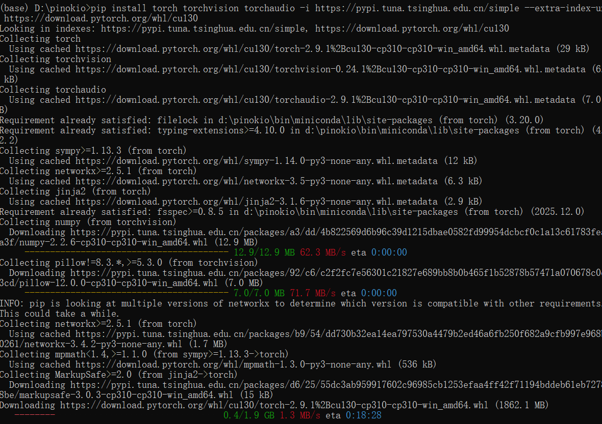

**CUDA**（Compute Unified Device Architecture）是 **NVIDIA（英伟达）推出的并行计算平台和编程模型**。简单说，它就是 **让NVIDIA显卡不仅能打游戏/做图形处理，还能进行通用科学计算的“超级加速器”**。

## 一个直观比喻

```
普通CPU = 一位数学教授
    ↓
    能解复杂方程，但一次只能解一个

NVIDIA GPU + CUDA = 一个教室的小学生
    ↓
    每人解一个简单题目，成千上万小学生同时工作
```

## 核心理解

### 1. **CUDA 让GPU做计算**
- **传统GPU**：只负责图形渲染（游戏画面、视频特效）
- **CUDA加持的GPU**：变成**通用计算设备**，能处理：
  - 科学模拟
  - 人工智能训练
  - 大数据分析
  - 密码破解
  - 任何可以并行计算的任务

### 2. **为什么AI/深度学习依赖CUDA？**
```
训练一个AI识别猫的模型：
需要处理：10万张猫图片 × 每张图片数百万次计算

用CPU：可能需要几周
用GPU + CUDA：可能只需要几小时
```

## 你的实际应用场景

在安装Pinokio/AI应用时，经常遇到CUDA相关需求：

### 1. **安装AI框架时**
```bash
# 这些框架通常需要CUDA加速
pip install torch            # PyTorch
pip install tensorflow-gpu   # TensorFlow GPU版本
conda install pytorch cudatoolkit=11.3  # Conda安装

# 没有CUDA就只能用CPU版本，速度慢几十到几百倍
```

### 2. **错误信息中常见的CUDA**
```
CUDA out of memory        # GPU显存不足
CUDA version mismatch     # CUDA版本不匹配
CUDA driver is insufficient # 显卡驱动太旧
```

## CUDA的组成部分

```
CUDA 生态系统包含：
├── 硬件层：NVIDIA GPU（GTX/RTX/Quadro/Tesla系列）
├── 驱动层：NVIDIA显卡驱动程序
├── 运行时：CUDA Toolkit（核心库）
├── 开发层：CUDA SDK、Nsight工具
└── 应用层：PyTorch、TensorFlow等AI框架
```

## 检查你的系统是否支持CUDA

### 1. **查看显卡型号**
```bash
# Windows：按 Win+R，输入 dxdiag
# 或打开任务管理器 → 性能 → GPU
# 或命令行
nvidia-smi  # 如果有安装驱动
```

### 2. **查看CUDA版本**
```bash
# 如果有安装NVIDIA驱动
nvidia-smi
# 右上角显示：CUDA Version: 12.4

# 查看已安装的CUDA Toolkit
nvcc --version
```

### 3. **支持CUDA的常见显卡系列**
```
✅ 支持CUDA的：
- GeForce RTX 系列：RTX 3060, 4070, 4090等
- GeForce GTX 系列：GTX 1050, 1080 Ti, 1660等
- Quadro/Tesla 系列：专业/服务器显卡
- NVIDIA笔记本显卡：MX系列除外

❌ 不支持CUDA的：
- Intel 集成显卡
- AMD 显卡（用ROCm平台）
- NVIDIA的某些旧卡/低端卡
```

## 安装与配置CUDA

### 安装顺序（重要！）
```
1. 确认显卡支持CUDA
2. 安装NVIDIA显卡驱动（最新版）
3. 安装CUDA Toolkit
4. 安装cuDNN（深度神经网络加速库）
5. 安装AI框架（PyTorch/TensorFlow）
```

### 版本匹配表（关键！）
| AI框架 | 推荐CUDA版本 | 说明 |
|--------|-------------|------|
| PyTorch最新 | CUDA 11.8 / 12.1 | 官网有明确对应表 |
| TensorFlow 2.x | CUDA 11.x | 版本要求严格 |
| 大部分AI应用 | CUDA 11.x | 最广泛兼容 |

### 通过Conda简化安装（推荐新手）
```bash
# Conda会自动处理CUDA依赖
conda install pytorch torchvision torchaudio pytorch-cuda=11.8 -c pytorch -c nvidia

# 或安装TensorFlow GPU版
conda install tensorflow-gpu cudatoolkit=11.2
```

## CUDA在AI工作流程中的作用

### 训练阶段加速
```python
import torch

# 如果没有CUDA，这行会使用CPU
device = torch.device("cuda" if torch.cuda.is_available() else "cpu")

# 将模型和数据放到GPU
model = model.to(device)
data = data.to(device)

# GPU加速训练，速度提升10-100倍
loss = model(data)
```

### 推理阶段加速
```
在线AI服务（如ChatGPT）：
用户输入 → 服务器GPU + CUDA → 秒级响应
              ↓
          如果用CPU → 可能需要几十秒
```

## 常见问题与解决

### 问题1：CUDA版本冲突
**症状**：
```
RuntimeError: CUDA error: no kernel image is available for execution on the device
```
**解决**：
```bash
# 检查并匹配版本
python -c "import torch; print(torch.__version__); print(torch.version.cuda)"
nvidia-smi  # 查看驱动支持的CUDA版本
```

### 问题2：显存不足（最常见）
**症状**：
```
CUDA out of memory. Tried to allocate...
```
**解决**：
```python
# 减少批量大小
batch_size = 16  # 改为 8 或 4

# 清理缓存
torch.cuda.empty_cache()

# 使用梯度累积
# 或换用更小的模型
```

### 问题3：驱动太旧
```
CUDA driver version is insufficient for CUDA runtime version
```
**解决**：更新NVIDIA显卡驱动

## 性能对比实例

| 任务 | CPU时间 | GPU + CUDA时间 | 加速比 |
|------|--------|---------------|--------|
| 训练ResNet50 | 72小时 | 2小时 | 36倍 |
| 图像风格转换 | 45秒 | 0.5秒 | 90倍 |
| 语言模型推理 | 8秒 | 0.1秒 | 80倍 |

## 替代方案

如果你的显卡是AMD或没有独立显卡：

### 1. **AMD显卡**：使用ROCm平台
```bash
# AMD的CUDA替代方案
pip install torch --index-url https://download.pytorch.org/whl/rocm5.7
```

### 2. **仅CPU**：使用CPU版本
```bash
# 安装CPU版本的AI框架
pip install torch --index-url https://download.pytorch.org/whl/cpu
```

### 3. **云端GPU**：租用服务
- Google Colab（免费）
- AWS/GCP/Azure GPU实例
- 国内：阿里云、腾讯云GPU服务器

## 你的具体情况建议

基于你之前遇到的安装问题：

### 如果你有NVIDIA显卡：
1. **先检查兼容性**：
   ```bash
   nvidia-smi  # 或查看显卡型号
   ```
2. **通过Conda安装**（避免手动配置）：
   ```bash
   conda install cudatoolkit=11.8  # 根据你的显卡选择版本
   ```
3. **验证安装**：
   ```python
   python -c "import torch; print(torch.cuda.is_available())"
   ```

### 如果你没有NVIDIA显卡：
1. **直接安装CPU版本**，接受较慢的速度
2. **或考虑云端GPU服务**
3. **对于大多数“尝鲜”项目，CPU版本也足够**

## CUDA生态系统概览

```
应用层:   PyTorch, TensorFlow, JAX, CUDA加速的科研软件
          ↓
开发层:   CUDA C/C++, Python库, 调试工具
          ↓
运行时:   CUDA Toolkit (nvcc编译器, 运行时库)
          ↓
驱动层:   NVIDIA显卡驱动程序
          ↓
硬件层:   NVIDIA GPU (有CUDA核心的型号)
```

## 总结

**CUDA是NVIDIA显卡的“计算超能力开关”**：

- ✅ **干什么用**：让GPU进行科学计算，尤其是AI/深度学习
- ✅ **谁需要它**：做AI开发、科学计算、大规模数据处理的人
- ✅ **怎么获得**：需要NVIDIA显卡 + 安装驱动和CUDA Toolkit
- ✅ **在你的场景中**：Pinokio安装的AI应用可能需要CUDA才能全速运行

**一句话理解**：
> 没有CUDA，GPU只是游戏显卡；有了CUDA，GPU变成超级计算机。

对于你的情况：如果安装的AI应用运行特别慢，或者要求安装CUDA相关包，说明它需要GPU加速。你可以先确认自己的硬件，然后通过Conda简化安装过程。如果硬件不支持，用CPU版本也能运行，只是速度会慢很多。

# 手动下载安装
下载网址[Manage | Anaconda.org](https://anaconda.org/conda-forge/cudatoolkit/files/manage?version=11.8.0)
conda install "D:\pinokio\bin\miniconda\pkgs\cudatoolkit-11.8.0-h09e9e62_13.conda"
1.确保 Pinokio 的 base 环境已激活
 显示 (base) 表示已激活
2.卸载现有的 PyTorch（如果是 CUDA 12.1 版本）
pip uninstall torch torchvision torchaudio -y
3.安装正确的 PyTorch（使用官网安装，网络不稳定，报错）
pip install torch torchvision torchaudio --index-url https://download.pytorch.org/whl/cu130

### 使用国内镜像源
1. 使用清华镜像源，速度也不快。
pip install torch torchvision torchaudio -i https://pypi.tuna.tsinghua.edu.cn/simple --extra-index-url https://download.pytorch.org/whl/cu130

2. 或者使用阿里云镜像
pip install torch torchvision torchaudio -i https://mirrors.aliyun.com/pypi/simple/ --extra-index-url https://download.pytorch.org/whl/cu130

3. 或者使用豆瓣镜像
pip install torch torchvision torchaudio -i https://pypi.douban.com/simple/ --extra-index-url https://download.pytorch.org/whl/cu130