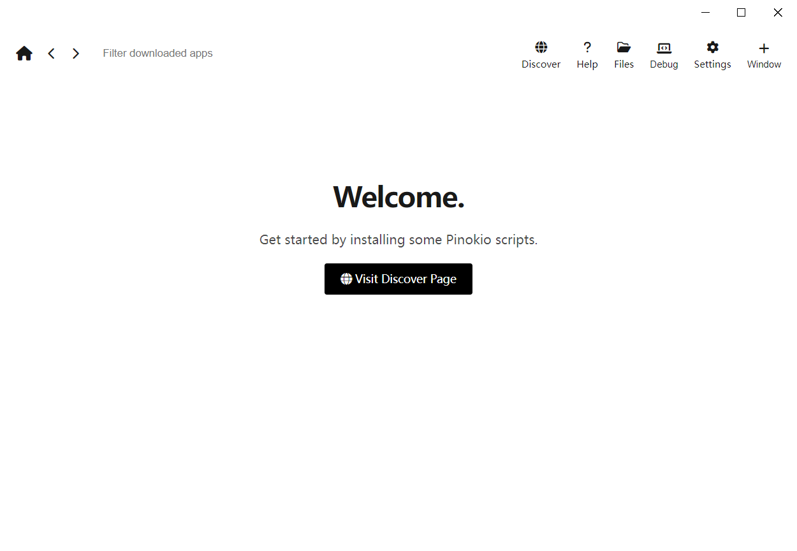

开源地址：[pinokiocomputer/program.pinokio.computer: pinokio official documentation](https://github.com/pinokiocomputer/program.pinokio.computer)

#### Step 1. Download  第一步：下载
[Download for Windows  下载适用于 Windows 的版本](https://github.com/pinokiocomputer/pinokio/releases/download/3.8.0/Pinokio-3.8.0-win32.zip)

#### Step 2. Unzip  步骤 2. 解压缩
解压缩下载的文件，你会看到一个 .exe 安装程序文件。

#### Step 3. Install  步骤 3. 安装

如果出现提示信息

1. Click **"More Info"**  
    点击 **“更多信息”**
2. Then click **"Run anyway"**  
    然后点击 **“仍然运行”。**

# Quickstart  快速入门
Pinokio 是一个独立的平台，允许您以隔离的方式安装应用程序。
