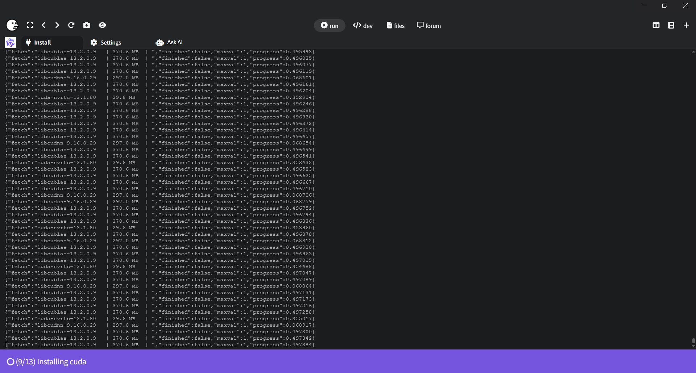

开源地址：[pinokiocomputer/program.pinokio.computer: pinokio official documentation](https://github.com/pinokiocomputer/program.pinokio.computer)
[Pinokio官网](https://pinokio.co/)
#### Step 1. Download  第一步：下载
到官网下载最新版安装程序[Pinokio官网](https://pinokio.co/)
[Download for Windows  下载适用于 Windows 的版本3.8.0](https://github.com/pinokiocomputer/pinokio/releases/download/3.8.0/Pinokio-3.8.0-win32.zip)

#### Step 2. Install  安装

如果出现提示信息

1. Click **"More Info"**  
    点击 **“更多信息”**
2. Then click **"Run anyway"**  
    然后点击 **“仍然运行”。**

# Quickstart  快速入门
Pinokio 是一个独立的平台，允许您以隔离的方式安装应用程序。
你可以浏览主页上你感兴趣的软件一键部署

你也可以按照教程部署Github上的项目。

这个安装过程是比较漫长的，而且一旦网络获取失败，它会报错，退出后没有检查已安装的部分，而是清除了bin目录下上一次的全局安装模块，重新再来一遍，非常的耗时。deepseek说是安装到windows环境中，官方文件说是安装在pinokio独立的环境中。
实际上，安装的过程并不顺利，多次中断，需要重新再来，耗费了大量的耐心。

[conda是什么](conda是什么.md)

- [cuda是什么及安装遇到的坑：注意显卡的版本](cuda是什么及安装遇到的坑：注意显卡的版本.md)
- [pip是什么？简单来说，pip 就是 Python 的“应用商店”](pip是什么？简单来说，pip%20就是%20Python%20的“应用商店”.md)
开始自动下载安装。
快速浏览一下每个文件夹的功能：
1. `api`  ：存储所有已下载的应用程序（脚本）。
    此文件夹内的文件夹将显示在您的 Pinokio 主页上。
2. `bin` ：存储多个应用程序共享的全局安装模块，这样您就不需要重复安装它们。例如， `ffmpeg` 、 `nodejs` 、 `python` 等。
3. `cache` ：存储您运行的应用程序自动缓存的所有文件。
    - 如果出现问题，删除此文件夹并重新开始可能会解决问题。
    - 删除 `cache` 文件夹是可以的，因为当您开始使用应用程序时，应用程序会自动重新填充该文件夹。
4. `drive` ：存储由 [fs.link](https://github.com/pinokiocomputer/program.pinokio.computer#fslink) Pinokio API 创建的所有虚拟驱动器
5. `logs` ：存储每个应用程序的所有日志文件。
安装卡顿在这个状态

我们注意到，命令行显示(env) (base) c:\pinokio\bin\py>
(env)    # Python venv 虚拟环境（项目特定）
(base)   # Anaconda 基础环境（系统级）
c:\pinokio\bin\py>  # 当前目录
### **为什么会有两个环境提示符？**
这是因为：
- **base** 环境提供了 `conda` 工具和一些基础依赖
- **env** 环境是 Pinokio 创建的专用环境，用于安装项目特定的依赖
- **两个环境都被激活**是为了让安装脚本能够访问两个环境的工具和库
