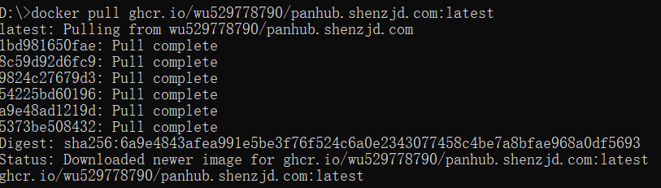

项目地址：[wu529778790/panhub.shenzjd.com: 一个 聚合的网盘搜索工具。它可以聚合多个优质资源站和公开频道,一次搜索即可覆盖阿里云盘、夸克、百度网盘、115、迅雷等热门网盘资源。它提供智能排序、分类型展示、极速部署等功能,并且是免费开源、零广告、轻量部署的。](https://github.com/wu529778790/panhub.shenzjd.com)

# 1、准备好Docker Desktop

# 2、获取Docker镜像
在CMD下运行`docker pull ghcr.io/wu529778790/panhub.shenzjd.com:latest`

在Docker的images下就会有镜像了。

# 3、运行镜像
在CMD下执行`docker run --name panhub -p 3000:3000 -d ghcr.io/wu529778790/panhub.shenzjd.com:latest`

# 4、打开WEB端
[PanHub - 全网最全的网盘搜索 · PanHub](http://127.0.0.1:3000/)

