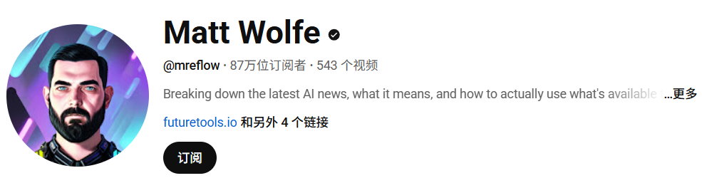

# 李沐（亚马逊首席科学家）

# 台大教授李宏毅

# OpenAI创始人Andrej Karpathy
AI教母李飞飞的学生，他能用浅显易懂的语言解释复杂的AI原理，是普通人理解AI底层机制的最佳捷径。

# 机器学习：吴恩达

他能帮你快速建立起学习AI的系统性思维，他擅长用清晰的结构讲AI趋势和落地逻辑。 

# Andrej Karpathy
 

# Greg Isenberg
[Greg Isenberg - YouTube](https://www.youtube.com/@GregIsenberg)
分享AI时代的各种创业想法，包括做产品、找赛道和赚钱的思路，非常具备实操性。 第四位，每周会发半小时的视频，总结盘点最新的AI热点和工具，内容轻松有趣，属于对非专业人士非常友好的AI科普。

# Matt Wolfe
[Matt Wolfe - YouTube](https://www.youtube.com/@mreflow)
深度解读AI论文和技术报告，能帮你看懂AI行业真正的前沿。
