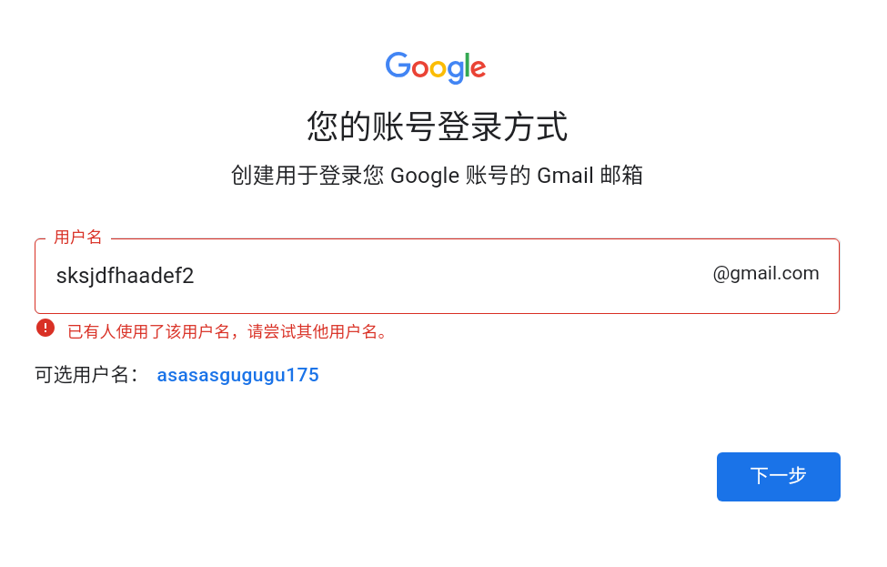

## 进阶教程：利用安卓模拟器环境突破 Google 账号注册风控

> 摘要：本教程旨在解决 PC 端注册 Gmail 时频繁出现的“手机扫码验证”死循环问题。通过构建隔离的安卓模拟器环境并配合透明代理，模拟真实且干净的移动端设备指纹，从而绕过 Google 针对 PC 浏览器的风控机制。

## 原理解析：为什么浏览器注册总是失败？

Google 的风控系统会检测浏览器指纹（User Agent, Cookies, Canvas 指纹等）。当你在常用的 PC 浏览器上注册时，如果你的 IP 地址信誉度较低，Google 会要求你用另一台手机扫描二维码验证，导致陷入“死循环”。

**解决方案核心**： 使用 **BlueStacks（蓝叠）** 等安卓模拟器，在 PC 上模拟出一台全新的安卓手机。对 Google 服务器而言，这看起来像是一个全新的移动设备在尝试注册，因此通常会放宽验证门槛，允许直接通过手机号短信验证，如果你的ip足够纯净 甚至可以跳过扫码验证。

---

## 环境与工具准备

在开始之前，请确保已准备好以下环境：

1. **安卓模拟器**：
    - 推荐软件：**BlueStacks 5 国际版** (请勿使用国内版)。
    - 版本建议：**Android 11** 或 **Android 13 (Beta)** 实例（高版本安卓系统仿真度更高）。
    - _下载地址请访问 BlueStacks 国际官网_**【！打不开！】**
        - [**](https://www.bluestacks.com/download.html)[https://www.bluestacks.com/download.html**](https://www.bluestacks.com/download.html)_。_
2. **网络环境（关键点）**：
    - 需要拥有稳定的科学网络节点。
    - **必须开启 TUN 模式 / 虚拟网卡模式**。
    - _注意：普通代理模式往往无法代理模拟器内的流量，导致模拟器直连国内网络而失败。_
## 详细操作步骤

### 第一阶段：网络层配置

这是最容易被忽视的一步。打开你的网络代理工具，进入设置：

- 找到 **“增强模式”**、**“TUN 模式”** 或 **“虚拟网卡”** 选项并开启。
- 确认开启后，电脑的所有流量（包括模拟器流量）都会强制经过代理节点。

### 第二阶段：模拟器初始化

1. 安装并启动 BlueStacks。
2. **多开器设置（可选但推荐）**：新建一个全新的 Android 13 实例，确保设备 ID 是全新的。
3. **检查连通性**：在模拟器内打开系统浏览器，访问 [Google.com](http://google.com/)，确认能否正常加载。如果无法加载，请检查第一阶段的 TUN 模式是否生效。

### 第三阶段：GPS 定位同步 (Windows 特性)

为了提高账号权重的初始信任度，建议“伪装到底”：

1. 查看你当前使用的代理节点 IP 所在地（例如：美国洛杉矶）。
2. 点击 BlueStacks 右侧工具栏的 **定位 (Location)** 图标。
3. 在地图上将模拟器的 GPS 定位手动设置到该城市附近。
    - _注：此步骤非必须，但能有效降低风控概率。_
### 第四阶段：执行注册

不要使用模拟器内嵌的旧版浏览器，建议按以下路径操作：

1. 在模拟器桌面点击 **系统应用 (System Apps)**。
2. 打开 **Google Play Store** 或 **Chrome**。
3. 点击 **Sign in (登录)** -> **Create account (创建账号)**。
4. 按常规流程填写姓名、生日、性别。

5. **手机号验证环节**：
    - 系统会自动根据你的 IP 识别国家代码（如美国 IP 显示 +1）。
    - **关键点**：手动点击国旗图标，切换回 **中国 (+86)**，输入你的国内手机号即可。

---
[显示查询自己的IP地址](https://www.ip111.cn/)

## 常见问题排查

如果在操作过程中依然遇到问题，请参考以下方案：

- **Q: 输入手机号显示“该号码无法用于验证”怎么办？**
    - **A**: 这通常是 IP 地址不干净（被太多人共用）导致的。请更换一个冷门的代理节点，并**清除模拟器内 Google Play 服务的数据**后重试。
- **Q: 模拟器无法联网？**
    - **A**: 请再次确认代理软件的 **TUN/透明代理** 模式已开启。如果仍不行，尝试在模拟器设置的网络选项中，将 DNS 修改为 Google DNS (8.8.8.8)。
- **Q: 注册成功后需要注意什么？**
    - **A**: 新号建议在模拟器内“养号”三天（如看看 YouTube、收发邮件），不要立即在指纹复杂的 PC 浏览器上登录，否则容易触发二次风控。
# gemini大学生认证

Gemini 3pro大学生免费1年领取活动持续到12.9号没领赶紧去价值一千超有用！！

## 1.首先去官网[https://gemini.google.com/](https://gemini.google.com/) 点击升级

如果这一步出现说地区禁用这个大概率就是你节点问题 需要切换节点换魔法等。可以通过[https://ipdata.co/](https://ipdata.co/)这个网站查询 最好是美国ip并且下面的威胁为绿色通过概率大

## 2.学生认证 这里有两种方法

- 通过ai生成学生信息以及成绩单然后使用模板网站生成学生证推荐
    - [https://thanhnguyxn.github.io/student-card-generator/](https://thanhnguyxn.github.io/student-card-generator/)
    - [https://student.frp.gs/](https://student.frp.gs/)
- 通过SheerID认证这个是最简单的只需要复制下面页面上的链接就可以了然后有两种方式
    - [https://ikey.me/](https://ikey.me/)
    - 通过Telegram 验证学生身份
        - 教程可以参考[https://github.com/TanhNguyen/SheerID-Verification-Tool/blob/master/docs/README.zh.md](https://github.com/TanhNguyen/SheerID-Verification-Tool/blob/master/docs/README.zh.md)
            1. 打开Telegram并访问以下机器人之一：
                - SheerID Verify Bot
                - SheerID VIP Bot
            2. 发送此命令：`/verify https://verify.sheerid.com/verify/****`（替换为您的验证链接）
            3. 等待机器人确认

## 3.最后一步就是绑卡了

需要Mastercard或者Visa类的国际银行卡或者使用PayPal或者虚拟卡这类怎么申请就不过多说明，如果没有想弄还是非常麻烦的推荐去闲鱼花几块钱弄一下 省时省心

到此就完成订阅了！！！祝大家都能成功